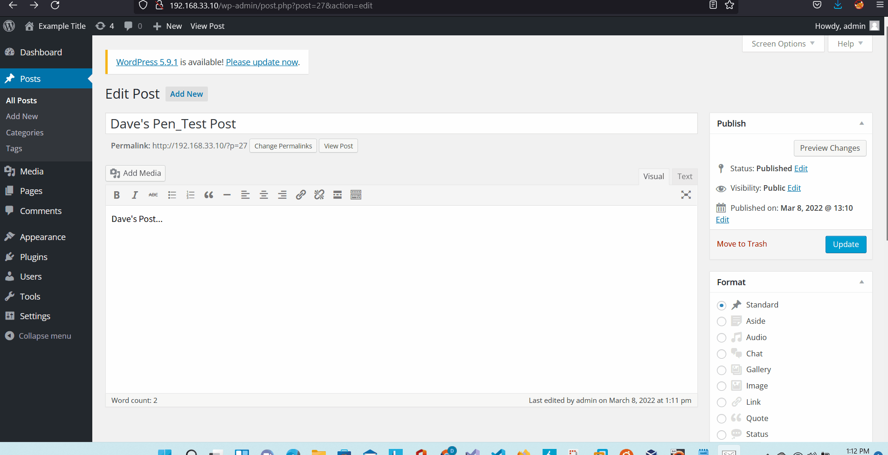
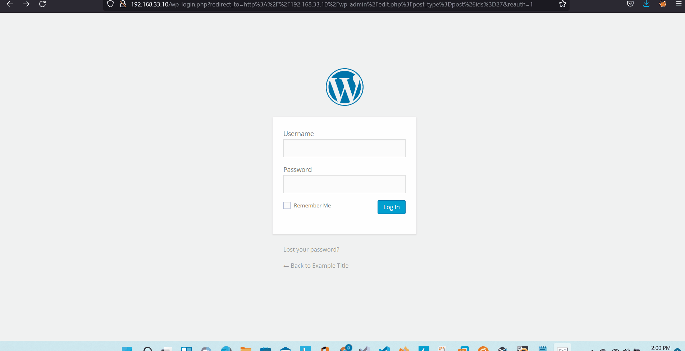

# Project 7 - WordPress Pentesting

Time spent: **16** hours spent in total

> Objective: Find, analyze, recreate, and document **five vulnerabilities** affecting an old version of WordPress

## Pentesting Report

### 1. (Required) Authenticated Stored Cross-Site Scripting (XSS) in YouTube URL Embeds
  - [ ] Summary: XSS vulnerability found in the YouTube embed shortcode function. The embed URL is passed to a function called autoembed() where a xss script can be executed.
    - Vulnerability types: XSS
    - Tested in version: 4.2
    - Fixed in version: 4.2.13
  - [ ] GIF Walkthrough: 
  - [ ] Steps to recreate:
  - [ ] I. Create a new post with the following script embeded: [embed src='https://youtube.com/embed/12345\x3csvg onload=alert(1)\x3e'][/embed]
  - [ ] II. The script will execute when the post is viewed.
  - [ ] Affected source code:
    - [Link 1](https://core.trac.wordpress.org/browser/trunk/src/wp-includes/class-wp-embed.php)
### 2. (Required) Theme Preview Cross-Site Scripting (XSS)
  - [ ] Summary: XSS vulnerability found in preview theme function, script can be injected in a post comment. 
    - Vulnerability types: XSS
    - Tested in version: 4.2
    - Fixed in version: 4.2.4
  - [ ] GIF Walkthrough: 
  - [ ] Steps to recreate: 
  - [ ] I. Create a new post.
  - [ ] II. Inject script into a Post comment.
  - [ ] Affected source code:
    - [Link 1](https://core.trac.wordpress.org/browser/trunk/src/wp-includes/theme.php)
### 3. (Required) Authenticated Cross-Site Scripting (XSS) via Media File Metadata
  - [ ] Summary: Metadata stored in the audio files are not sanitized and no output encoding is used on the meta information which can be vulnerable to XSS.
    - Vulnerability types: XSS
    - Tested in version: 4.2
    - Fixed in version: 4.2.13
  - [ ] GIF Walkthrough: 
  - [ ] Steps to recreate: 
  - [ ] I. Upload a MP3 file to the Media Library.
  - [ ] II. Inject script into description area for file metadata.
  - [ ] III. Leaving a comment or viewing attachment page will activate xss script.
  - [ ] Affected source code:
    - [Link 1](https://core.trac.wordpress.org/browser/branches/4.2/src/wp-admin/includes/media.php)
### 4. (Optional) User Enumeration
  - [ ] Summary: Different messages are displayed for invalid usernames and valid usernames (where passwords are incorrect) which can lead to user enumeration.
    - Vulnerability types: User Enumeration
    - Tested in version: 4.2
    - Fixed in version: unkown
  - [ ] GIF Walkthrough: 
  - [ ] Steps to recreate:
  - [ ] I. Enter "admin" as the username with a incorrect password which displays that the password is incorrect.
  - [ ] II. Enter "test" as the username with a incorrect password whcih displays invalid username.
  - [ ] Affected source code:
    - [Link 1](https://core.trac.wordpress.org/browser/tags/4.2/src/wp-login.php)
### 5. (Optional) XSS vulnerability in Page's Edit-page
  - [ ] Summary: Inject a script into the title section of a page which can exploit an XSS vulnerability. Injected script does not display on the published page but will trigger the injected script.
    - Vulnerability types: XSS
    - Tested in version: 4.2
    - Fixed in version: 4.7.1
  - [ ] GIF Walkthrough: 
  - [ ] Steps to recreate: 
  - [ ] I. Edit or create a new page
  - [ ] II. Add script at the end of the title section.
  - [ ] III. Update the page and view the page to activate the script.
  - [ ] Affected source code:
    - [Link 1](https://core.trac.wordpress.org/browser/tags/version/src/source_file.php) 

## Assets

List any additional assets, such as scripts or files

## Resources

- [WordPress Source Browser](https://core.trac.wordpress.org/browser/)
- [WordPress Developer Reference](https://developer.wordpress.org/reference/)

GIFs created with [ScreentoGif](https://www.screentogif.com/).

## Notes

There was a lot of "trial and error" moments in the implementation and exploitation of the various WordPress vulnerabilities.

## License

    Copyright [2022] [David Rowe]

    Licensed under the Apache License, Version 2.0 (the "License");
    you may not use this file except in compliance with the License.
    You may obtain a copy of the License at

        http://www.apache.org/licenses/LICENSE-2.0

    Unless required by applicable law or agreed to in writing, software
    distributed under the License is distributed on an "AS IS" BASIS,
    WITHOUT WARRANTIES OR CONDITIONS OF ANY KIND, either express or implied.
    See the License for the specific language governing permissions and
    limitations under the License.

