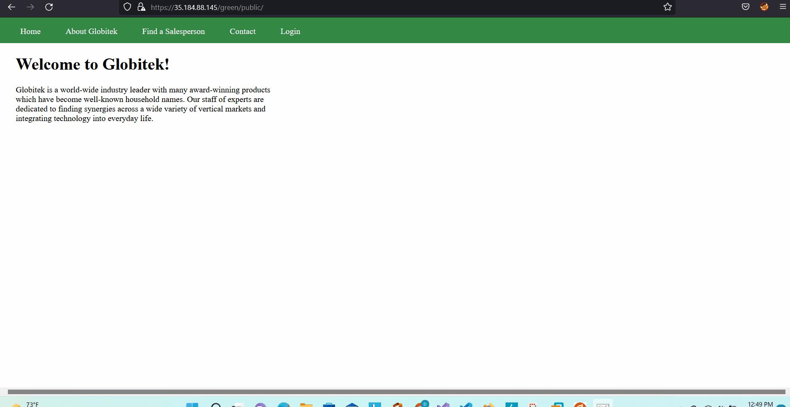
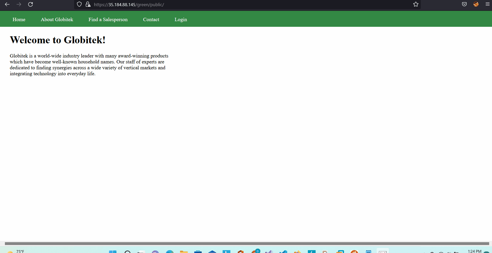
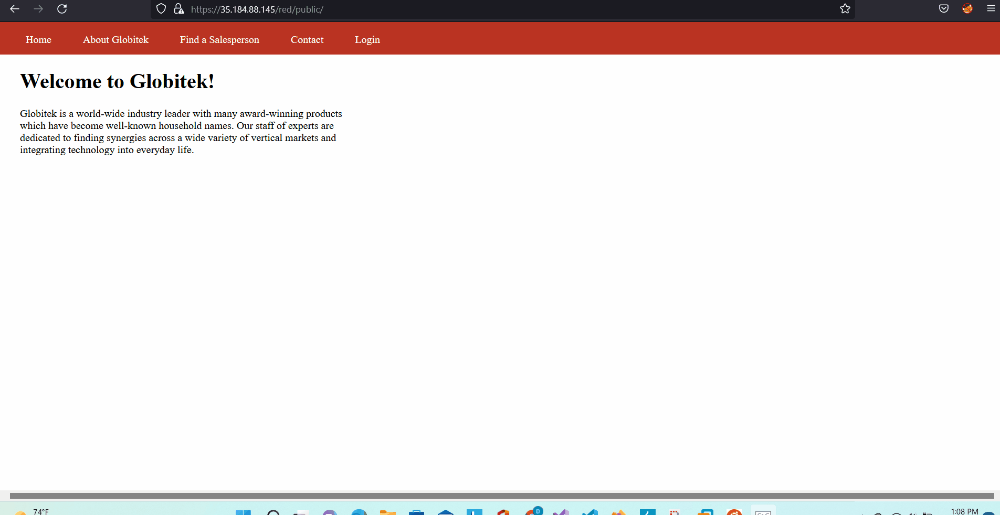

# Project 8 - Pentesting Live Targets

Time spent: **X** hours spent in total

> Objective: Identify vulnerabilities in three different versions of the Globitek website: blue, green, and red.

The six possible exploits are:

* Username Enumeration
* Insecure Direct Object Reference (IDOR)
* SQL Injection (SQLi)
* Cross-Site Scripting (XSS)
* Cross-Site Request Forgery (CSRF)
* Session Hijacking/Fixation

Each color is vulnerable to only 2 of the 6 possible exploits. First discover which color has the specific vulnerability, then write a short description of how to exploit it, and finally demonstrate it using screenshots compiled into a GIF.

## Blue

Vulnerability #1: SQL Injection (SQLi) - Utilizing the ID parameter in the URL parameter for the salesperson list, one can execute the SLEEP() function and make the site stall.

Description:

Vulnerability #2: Session Hijacking/Fixation - The session IDs are not regenerated when logging in. The same PHPSESSID from the RED site is used for accessing the blue site.

Description:

## Green

Vulnerability #1: Username Enumeration

Description: Existing usernames with incorrect passwords result in a bolded message while invalid usernames do not produce a bolded message.

Vulnerability #2: Cross-Site Scripting (XSS)

Description: The name and feedback fields are not properly sanitized allowing attackers to embed scripts into the fields that will trigger when the admin tries to view them.

## Red

Vulnerability #1: Insecure Direct Object Reference (IDOR)

Description: The salesperson area allows users to access page IDs they aren't supposed to because the query parameter "id" can be referenced directly, such as "Testy McTesterson" and "Lazy Lazyman" which are not suppose to be public. The other two (blue and green) sites do not allow the "id" numbers to be set above a certain point.

Vulnerability #2: __________________

Description:

## Notes

Describe any challenges encountered while doing the work
