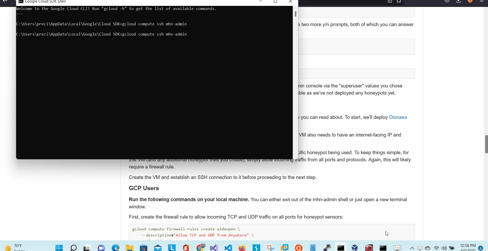

# Honeypot Assignment

**Time spent:** **7** hours spent in total

**Objective:** Create a honeynet using MHN-Admin. Present your findings as if you were requested to give a brief report of the current state of Internet security. Assume that your audience is a current employer who is questioning why the company should allocate anymore resources to the IT security team.

### MHN-Admin Deployment (Required)

**Summary:** How did you deploy it? Did you use GCP, AWS, Azure, Vagrant, VirtualBox, etc.?
I used the Google Cloud Platform to setup a Virtual Machine for the MHN Admin. I downloaded the Google Cloud SDK Shell and followed the instructions for how to setup the firewall-rules list and how to setup the inbound ports for the MHN Admin. After creating the MHN Admin, I established a ssh connection and installed MHN Admin Application at port http://34.132.1.64. From here, I created another VM for the honeypot application called Dionaea.

### Dionaea Honeypot Deployment (Required)

**Summary:** Briefly in your own words, what does dionaea do?
Dionaea is a honeypot setup that is used to trap malware attacks so that we can utilize that information to better defend our own applications from such attacks. After creating the honeypot VM, I installed Dionaea using the script command that I copied from the MHN admin console.

### Database Backup (Required) 

**Summary:** What is the RDBMS that MHN-Admin uses? What information does the exported JSON file record?
The MHN-Admin uses a RDBMS database that stores data in JSON format. The exported JSON file name 'session' contains a record of all the samples collected during the honeypot execution.

*Be sure to upload session.json directly to this GitHub repo/branch in order to get full credit.*
Upload completed.

## Notes

Describe any challenges encountered while doing the assignment.
This challenge was a lot of fun. I followed the assignment instructions and everything went really smooth.
